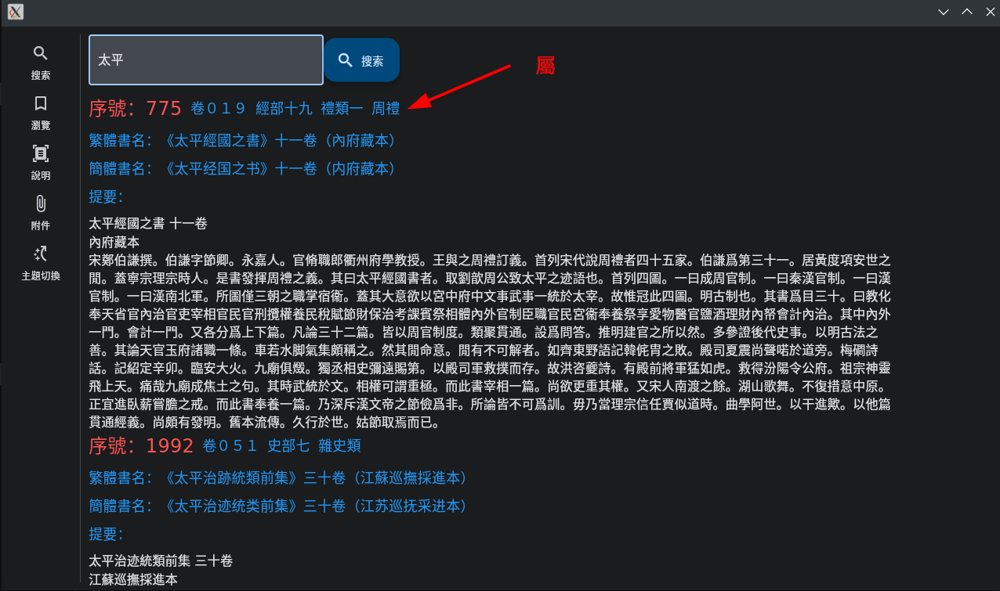
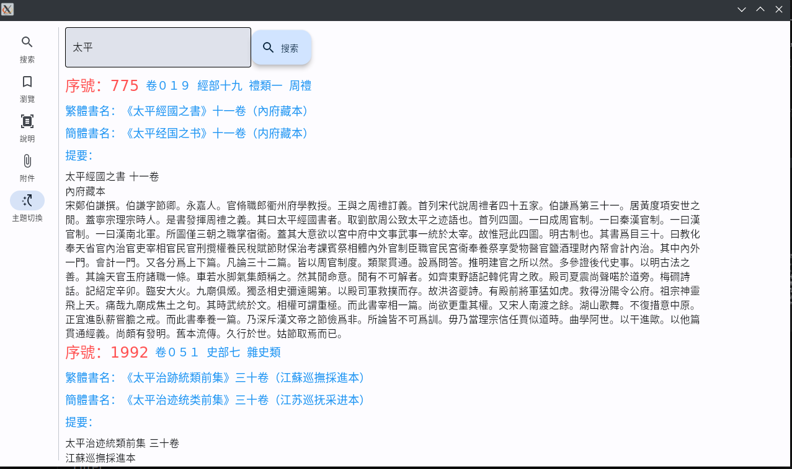

## 一、緣起

如果需要將四庫中的一本書歸入部、類、是否存目等帽子下面，並不是難事；只是繁瑣。

如果更甚一步，將之歸入屬、是否附錄的帽子下面，也不是難事，只是更繁瑣。

科學技術是第一生產力，科學技術解放生產力。

所以，爲什麼不用科技來解決這些繁瑣的事情呢？

## 二、數據來源

數據庫中的索引有兩個來源：
 1. Anna's Archive 中的 [EPUB 版](https://annas-archive.org/md5/04bf85548f949f0cef3acd869bc1655c)
 - 沒有更多信息，無法進行版本鑑定（也沒有此能力）
 - 文本應該是從簡體轉換成的繁體，其中有許多特殊的錯誤，如：
 - ”御定“寫成”禦定“，”卜法“寫成”蔔法“等等，多數已經改過來了。
 2. 日本：全国漢籍データベースには、書誌学上の重要性に鑑みて[『四庫全書總目提要』](http://kanji.zinbun.kyoto-u.ac.jp/db-machine/ShikoTeiyo/)
 - 底本は「民國二十二年 上海商務印書館 排印本」です。
 - 底本是排印本，找不到原本，但和影印本對照，是存在不少錯誤的
 - 如：”家傳“寫成”傳家“，”皃“寫成”兒“等，亦改了幾處。

 數據庫中的提要只有一個來源：
 1. 上述日本的索引網站，也提供了提要的數據；已用爬蟲爬下保存在數據庫。

## 三、索引說明
如果將EPUB版索引和日本版索引直接對比，有一千多條不同，超過一成。

如果將EPUB版索引和日本版索引都轉換爲簡體，實際上只有 604 條不同，其中有許多明顯的錯誤，但精力所限，只能將來再改，或期待衆人幫助。

存在問題的條目見後[所附](dif.md)。

索引中的屬、是否屬附錄是由在下手工補全，錯誤之處，還望[斧正](mailto:zlz_gty@foxmail.com)

在下將數據和軟件公開，是望借衆人之力除錯，歡迎來信反饋：zlz_gty@foxmail.com

## 四、軟件截圖

## License
[CC-BY-4.0](LICENSE)
